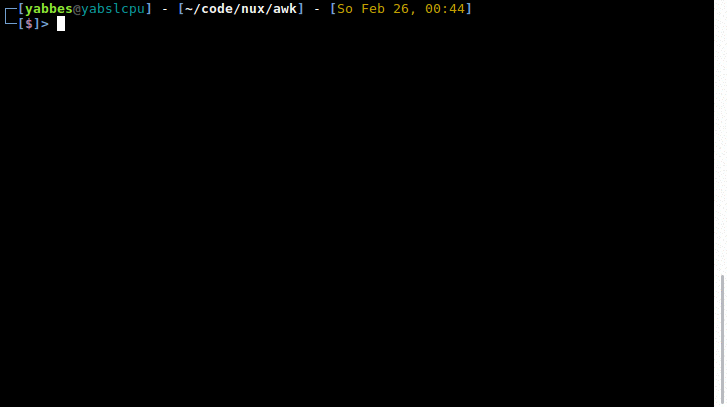

# New repository where I try to group everything connected with *nux*

## rc-files

## awk 
to honour the UNIX tradition, I wanted to learn some awk. Here are some examples:

**nospaces**, a script that will check your files for dreaded blank spaces at the end of lines

